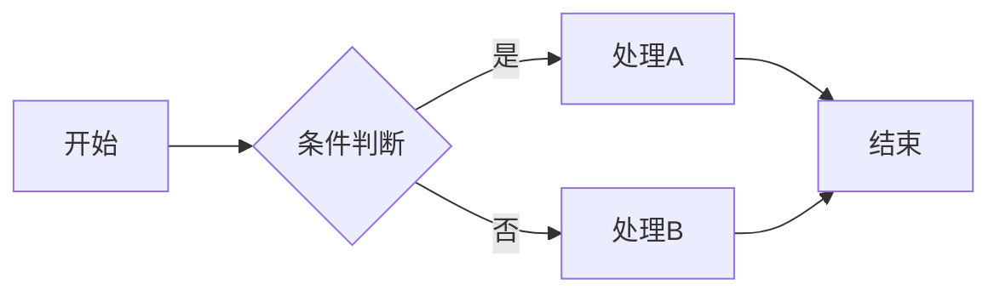
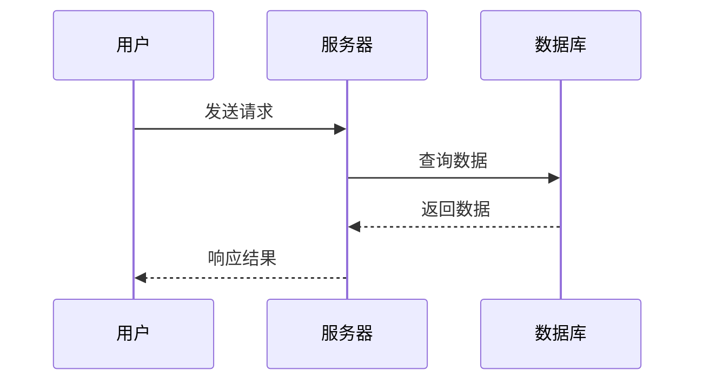
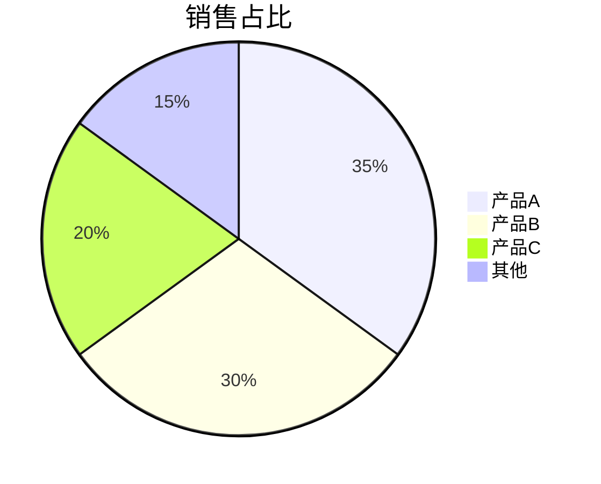

# 图表生成助手

## 图表选择指南

### 按数据类型选择

| 数据类型 | 推荐图表 |
|----------|----------|
| 趋势/时间序列 | 折线图、面积图 |
| 比较/排名 | 柱状图、条形图 |
| 占比/构成 | 饼图、环形图、堆叠图 |
| 分布 | 直方图、箱线图 |
| 关系/相关 | 散点图、气泡图 |
| 地理数据 | 地图、热力图 |
| 流程/层级 | 桑基图、树图 |

### 按分析目的选择

```
展示趋势 → 折线图
  - 单一趋势：基础折线图
  - 多系列对比：多折线图
  - 强调累积：面积图

比较大小 → 柱状图/条形图
  - 少量类别（<7）：柱状图
  - 类别名称长：条形图
  - 多系列：分组柱状图

展示占比 → 饼图/环形图
  - 类别少（<6）：饼图
  - 强调总量：环形图
  - 多维度：堆叠柱状图

展示分布 → 直方图/箱线图
  - 单变量分布：直方图
  - 对比分布：箱线图
  - 密度估计：核密度图

展示关系 → 散点图
  - 两变量关系：散点图
  - 三变量关系：气泡图
  - 多变量关系：散点矩阵
```

## 代码示例

### Python Matplotlib

```python
import matplotlib.pyplot as plt
import numpy as np

# 设置中文字体
plt.rcParams['font.sans-serif'] = ['SimHei']
plt.rcParams['axes.unicode_minus'] = False

# 折线图
fig, ax = plt.subplots(figsize=(10, 6))
x = ['1月', '2月', '3月', '4月', '5月']
y = [100, 120, 115, 130, 145]
ax.plot(x, y, marker='o', linewidth=2, markersize=8)
ax.set_title('月度销售趋势')
ax.set_xlabel('月份')
ax.set_ylabel('销售额（万元）')
ax.grid(True, alpha=0.3)
plt.show()

# 柱状图
fig, ax = plt.subplots(figsize=(10, 6))
categories = ['产品A', '产品B', '产品C', '产品D']
values = [45, 32, 28, 15]
colors = ['#4e79a7', '#f28e2c', '#e15759', '#76b7b2']
ax.bar(categories, values, color=colors)
ax.set_title('各产品销售额对比')
ax.set_ylabel('销售额（万元）')
plt.show()

# 饼图
fig, ax = plt.subplots(figsize=(8, 8))
labels = ['产品A', '产品B', '产品C', '其他']
sizes = [35, 30, 20, 15]
colors = ['#4e79a7', '#f28e2c', '#e15759', '#76b7b2']
ax.pie(sizes, labels=labels, colors=colors, autopct='%1.1f%%', startangle=90)
ax.set_title('销售额占比')
plt.show()
```

### Python Seaborn

```python
import seaborn as sns
import pandas as pd

# 设置样式
sns.set_theme(style="whitegrid")

# 分组柱状图
df = pd.DataFrame({
    '月份': ['1月', '2月', '3月'] * 2,
    '产品': ['产品A'] * 3 + ['产品B'] * 3,
    '销售额': [100, 120, 130, 80, 90, 110]
})
plt.figure(figsize=(10, 6))
sns.barplot(data=df, x='月份', y='销售额', hue='产品')
plt.title('各产品月度销售额对比')
plt.show()

# 箱线图
plt.figure(figsize=(10, 6))
sns.boxplot(data=df, x='产品', y='销售额')
plt.title('产品销售额分布')
plt.show()

# 热力图
correlation = df.pivot_table(values='销售额', index='产品', columns='月份')
plt.figure(figsize=(8, 6))
sns.heatmap(correlation, annot=True, cmap='YlOrRd', fmt='.0f')
plt.title('销售额热力图')
plt.show()
```

### JavaScript ECharts

```javascript
// 折线图
const lineOption = {
    title: { text: '月度销售趋势' },
    tooltip: { trigger: 'axis' },
    xAxis: {
        type: 'category',
        data: ['1月', '2月', '3月', '4月', '5月']
    },
    yAxis: { type: 'value', name: '销售额（万元）' },
    series: [{
        data: [100, 120, 115, 130, 145],
        type: 'line',
        smooth: true
    }]
};

// 柱状图
const barOption = {
    title: { text: '各产品销售额对比' },
    tooltip: {},
    xAxis: {
        type: 'category',
        data: ['产品A', '产品B', '产品C', '产品D']
    },
    yAxis: { type: 'value' },
    series: [{
        data: [45, 32, 28, 15],
        type: 'bar',
        itemStyle: {
            color: function(params) {
                const colors = ['#4e79a7', '#f28e2c', '#e15759', '#76b7b2'];
                return colors[params.dataIndex];
            }
        }
    }]
};

// 饼图
const pieOption = {
    title: { text: '销售额占比', left: 'center' },
    tooltip: { trigger: 'item' },
    series: [{
        type: 'pie',
        radius: '50%',
        data: [
            { value: 35, name: '产品A' },
            { value: 30, name: '产品B' },
            { value: 20, name: '产品C' },
            { value: 15, name: '其他' }
        ]
    }]
};
```

### Mermaid 图表

```markdown
# 流程图


# 时序图


# 饼图

```

## 设计原则

### 颜色选择
```
# 推荐配色方案
单色系：#4e79a7 的深浅变化
对比色：#4e79a7, #e15759
多色系：#4e79a7, #f28e2c, #e15759, #76b7b2, #59a14f

# 注意事项
- 避免超过 7 种颜色
- 考虑色盲友好
- 重要数据用醒目颜色
```

### 图表优化
```
# 简洁性
- 移除不必要的网格线
- 精简图例
- 避免 3D 效果

# 可读性
- 数据标签清晰
- 字体大小适中
- 对比度足够

# 准确性
- Y 轴从 0 开始（柱状图）
- 比例正确
- 注明数据来源
```

## 输出格式

根据数据特点，输出：
1. **推荐图表类型**及原因
2. **完整代码**（指定语言/库）
3. **设计建议**（颜色、布局）
4. **交互建议**（如适用）
