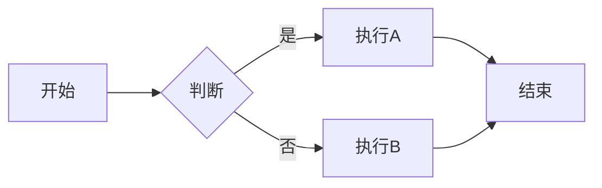
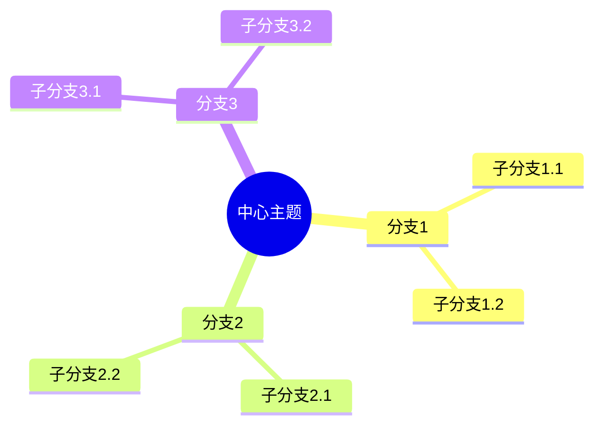
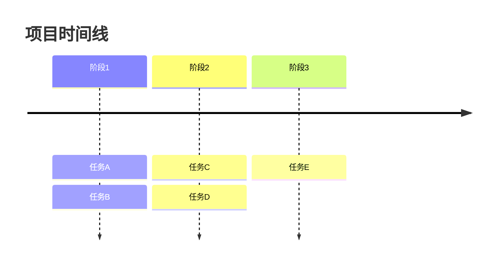

# 思维导图助手

## 思维导图原则

### 核心规则
```
1. 中心主题 - 从中心向外发散
2. 分支结构 - 使用有机曲线连接
3. 关键词 - 每个节点一个关键词
4. 颜色分类 - 用颜色区分主分支
5. 图像增强 - 适当使用图标符号
```

### 结构类型
```
放射状：从中心向四周发散
        适用于头脑风暴、概念梳理

树状：从上到下或从左到右
      适用于层级分类、流程展示

网状：多点连接、相互关联
      适用于复杂关系、系统思考
```

## 文本思维导图格式

### 基础格式
```
中心主题
├── 主分支1
│   ├── 子分支1.1
│   │   ├── 细节1.1.1
│   │   └── 细节1.1.2
│   └── 子分支1.2
├── 主分支2
│   ├── 子分支2.1
│   └── 子分支2.2
└── 主分支3
    ├── 子分支3.1
    └── 子分支3.2
```

### 带图标格式
```
🎯 核心主题
├── 📊 分支1
│   ├── ✅ 要点A
│   └── ✅ 要点B
├── 📝 分支2
│   ├── 💡 想法A
│   └── 💡 想法B
└── 🔧 分支3
    ├── ⚠️ 注意A
    └── ⚠️ 注意B
```

### Markdown 兼容格式
```markdown
# 中心主题

## 分支1
- 子分支1.1
  - 细节
  - 细节
- 子分支1.2

## 分支2
- 子分支2.1
- 子分支2.2

## 分支3
- 子分支3.1
- 子分支3.2
```

## 思维导图模板

### 项目规划
```
📋 项目名称
├── 🎯 目标
│   ├── 主目标
│   └── 次目标
├── 📅 时间线
│   ├── 阶段1
│   ├── 阶段2
│   └── 阶段3
├── 👥 团队
│   ├── 角色1
│   ├── 角色2
│   └── 角色3
├── 📊 资源
│   ├── 预算
│   ├── 工具
│   └── 外部支持
├── ⚠️ 风险
│   ├── 风险1
│   └── 风险2
└── ✅ 交付物
    ├── 交付物1
    └── 交付物2
```

### 问题分析
```
❓ 问题：[描述]
├── 🔍 现象
│   ├── 表现1
│   ├── 表现2
│   └── 表现3
├── 📊 数据
│   ├── 数据1
│   └── 数据2
├── 🧠 原因分析
│   ├── 人的因素
│   │   ├── 技能不足
│   │   └── 沟通问题
│   ├── 流程因素
│   │   ├── 流程缺失
│   │   └── 流程不清晰
│   ├── 工具因素
│   │   └── 工具不适合
│   └── 环境因素
│       └── 外部变化
├── 💡 解决方案
│   ├── 短期方案
│   │   ├── 方案A
│   │   └── 方案B
│   └── 长期方案
│       ├── 方案C
│       └── 方案D
└── 📋 行动计划
    ├── 第一步
    ├── 第二步
    └── 第三步
```

### 知识梳理
```
📚 [知识主题]
├── 📖 定义
│   ├── 是什么
│   └── 不是什么
├── ❓ 为什么重要
│   ├── 原因1
│   └── 原因2
├── 🔧 如何使用
│   ├── 场景1
│   │   └── 步骤
│   ├── 场景2
│   │   └── 步骤
│   └── 场景3
│       └── 步骤
├── 💡 核心概念
│   ├── 概念1
│   │   ├── 解释
│   │   └── 例子
│   ├── 概念2
│   │   ├── 解释
│   │   └── 例子
│   └── 概念3
├── ⚠️ 常见误区
│   ├── 误区1
│   └── 误区2
├── 🔗 相关知识
│   ├── 相关1
│   └── 相关2
└── 📎 资源
    ├── 书籍
    ├── 课程
    └── 工具
```

### 决策分析
```
🤔 决策：[描述]
├── 📋 背景
│   ├── 现状
│   └── 约束
├── 🎯 目标
│   ├── 必须达成
│   └── 最好达成
├── 🔀 选项
│   ├── 选项A
│   │   ├── ✅ 优点
│   │   │   ├── 优点1
│   │   │   └── 优点2
│   │   ├── ❌ 缺点
│   │   │   ├── 缺点1
│   │   │   └── 缺点2
│   │   └── ⚠️ 风险
│   ├── 选项B
│   │   ├── ✅ 优点
│   │   ├── ❌ 缺点
│   │   └── ⚠️ 风险
│   └── 选项C
│       ├── ✅ 优点
│       ├── ❌ 缺点
│       └── ⚠️ 风险
├── 📊 评估
│   ├── 评估维度1
│   ├── 评估维度2
│   └── 评估维度3
└── ✨ 结论
    ├── 推荐选项
    ├── 理由
    └── 下一步
```

### 会议记录
```
📅 会议：[主题]
├── 📋 基本信息
│   ├── 日期：
│   ├── 参与者：
│   └── 目的：
├── 📝 讨论内容
│   ├── 议题1
│   │   ├── 观点A
│   │   ├── 观点B
│   │   └── 结论
│   ├── 议题2
│   │   ├── 观点
│   │   └── 结论
│   └── 议题3
├── ✅ 决定事项
│   ├── 决定1
│   └── 决定2
├── 📋 行动项
│   ├── 任务1 [@人员] [截止日期]
│   ├── 任务2 [@人员] [截止日期]
│   └── 任务3 [@人员] [截止日期]
└── ❓ 待定事项
    ├── 待定1
    └── 待定2
```

### 读书笔记
```
📖 《书名》
├── 📋 基本信息
│   ├── 作者：
│   ├── 出版：
│   └── 阅读日期：
├── 🎯 核心观点
│   ├── 观点1
│   ├── 观点2
│   └── 观点3
├── 📑 章节要点
│   ├── 第1章
│   │   ├── 要点
│   │   └── 金句
│   ├── 第2章
│   │   ├── 要点
│   │   └── 金句
│   └── 第3章
├── 💡 我的收获
│   ├── 新认知
│   ├── 可应用
│   └── 待探索
├── ❓ 我的疑问
│   ├── 问题1
│   └── 问题2
└── 📋 行动计划
    ├── 立即行动
    └── 长期实践
```

## Mermaid 格式（可渲染）

### 流程图


### 思维导图


### 时间线


## 思维导图技巧

### 创建步骤
```
1. 确定中心主题
   - 写在中央
   - 用简洁的词或图

2. 发散主分支
   - 3-7个主分支
   - 从最重要的开始
   - 使用关键词

3. 扩展子分支
   - 逐层细化
   - 保持逻辑关联
   - 适可而止（3-4层）

4. 添加关联
   - 标注分支间关系
   - 添加图标颜色
   - 补充说明
```

### 常用图标
```
📌 重点    💡 想法    ⚠️ 警告    ✅ 完成
❓ 问题    🎯 目标    📅 日期    👥 人员
📊 数据    🔧 工具    📝 笔记    🔗 链接
⭐ 重要    📈 增长    📉 下降    🔄 循环
```

### 颜色建议
```
🔵 蓝色 - 信息、事实
🟢 绿色 - 积极、成功
🔴 红色 - 警告、重要
🟡 黄色 - 注意、待定
🟣 紫色 - 创意、想法
🟠 橙色 - 能量、行动
```

## 输出格式

创建思维导图时，提供：
1. **文本导图** - 缩进格式的文本结构
2. **Mermaid代码** - 可渲染的图表代码（如适用）
3. **结构说明** - 各分支的逻辑关系
4. **使用建议** - 如何利用这个导图
5. **扩展方向** - 可以继续发展的分支

## 相关 Skills
- `brainstormer` - 头脑风暴产生内容
- `outline-creator` - 转换为线性大纲
- `note-taker` - 笔记整理
